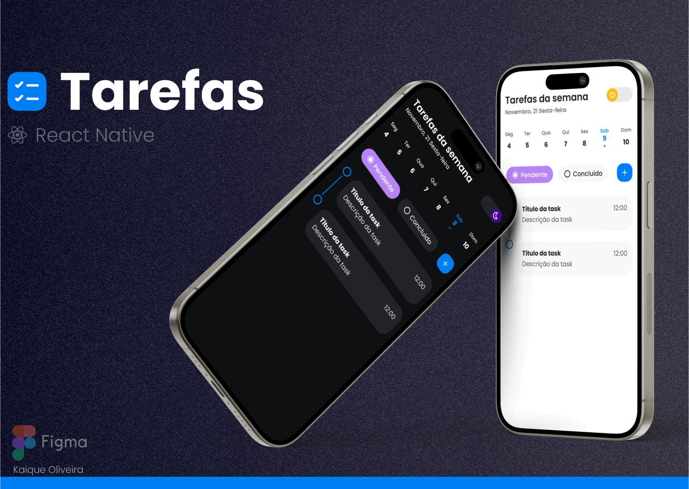

<h1 align="center">
  <br>

  <br>
Tarefas - Android | IOS
  <br>
</h1>

<h4 align="center">Um aplicativo para organizar as tarefas utilizando <a href="https://reactnative.dev" target="_blank">React Native</a>.</h4>


<p>Clique no player para visualizar a demonstração no YouTube 🖥️.</p>

[](https://youtu.be/-MfSOmsy2u4 "Assistir ao video")


## Protótipo figma

<p>Clique na imagem para visualizar no figma.</p>

  [](https://www.figma.com/file/vQn11NAmOzq4AMtQJvklgJ/Tarefas?type=design&node-id=0%3A1&mode=design&t=QjjMl6p7gP6IGM2W-1 "Visualizar no figma")


## Sobre o app Tarefas

Imagine um aplicativo que funciona como seu assistente pessoal para manter suas tarefas organizadas e sua vida mais tranquila. Esse é o propósito do app desenvolvido com React Native.

Com ele, você pode criar listas de tarefas facilmente, durante sete dias da semenas, sempre se baseando no dia atual.

O melhor de tudo é a possibilidade de acessar o aplicativo no Android ou IOS.

Com uma interface intuitiva e amigável, podendo ser alternado entre o modo light ou dark.

Todas as tarefas são salvas localmente, garantindo a visualização a qualquer momento, mesmo que o app seja encerrado.

## Como usar

Para clonar e executar este aplicativo, você precisará do [Git](https://git-scm.com) e do [Node.js](https://nodejs.org/en/download/) (que vem com o [npm](http://npmjs.com)) instalados em seu computador. 
<br>
Na sua linha de comando:

```bash
# Clone o repositorio
$ git clone https://github.com/kaique-oliveira/tarefas-mobile.git

# Entre no repositório
$ cd tarefas-mobile

# Instalar dependências
$ npm install

# Execute o aplicativo
$ npm start 

# Execute o aplicativo direto no emulador IOS
$ npm run ios 

# Execute o aplicativo direto no emulador Android
$ npm run android 

```

## Creditos

Principais frameworks e bibliotecas utilizados:

- [Expo](https://expo.dev)
- [React-Native](https://reactnative.dev)
- [TypeScript](https://www.typescriptlang.org)
- [Styled-Components](https://styled-components.com)
- [Phosphor-React-Native](https://github.com/duongdev/phosphor-react-native)
- [React-Native-Safe-Area-Context](https://www.npmjs.com/package/react-native-safe-area-context)
- [AsyncStorage](https://docs.expo.dev/versions/latest/sdk/async-storage/)

---

> GitHub [@kaique-oliveira](https://github.com/kaique-oliveira) &nbsp;&middot;&nbsp;
> Linkedin [@kaique-oliveira](https://www.linkedin.com/in/kaique-oliveira-a21273162/)


